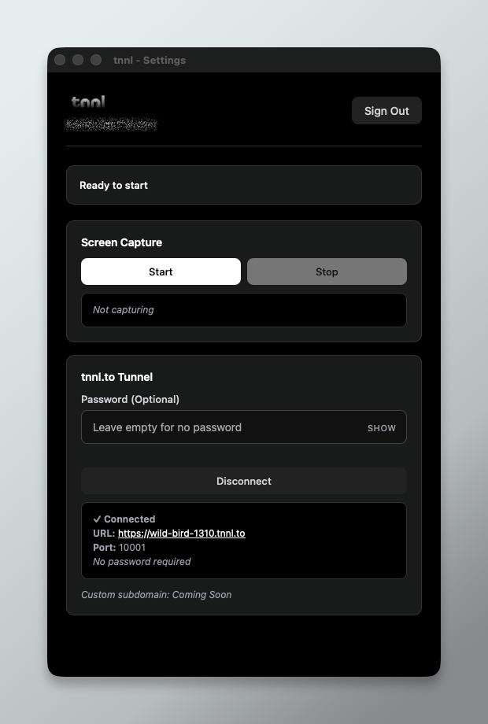

# tnnl - Remote Screen Access Made Simple

**tnnl** is a remote desktop application that provides instant public URL access to your computer. No VPN, no port forwarding, no network configuration required.

[](LICENSE)

<p align="center">
  
</p>

## Features

- ✅ **Zero Configuration**: Works behind firewalls, NAT, and restrictive corporate networks
- ✅ **Instant Access**: Get a public URL in seconds (e.g., `wild-fox-1722.tnnl.to`)
- ✅ **SSH Tunneling**: Secure connections via SSH reverse tunnels
- ✅ **Web-based Client**: No software install required on remote device
- ✅ **Real-time Streaming**: 10 FPS screen capture with mouse/keyboard control
- ✅ **Optional Password Protection**: HTTP Basic Auth for tunnel access
- ✅ **Cross-platform**: macOS support (Windows/Linux coming soon)
- ✅ **File Transfer**: Seamlessly transfer files between devices
- ✅ **App Switching**: Visual app dock for quick navigation

## Architecture

```
┌─────────────────────────────────────────────────────────┐
│                    tnnl.to Domain                       │
│                                                         │
│  Landing Page (/)   ←→   Coordination Server (/ws)     │
│  Static marketing        WebSocket auth & tunnels      │
└────────────────┬────────────────────────────────────────┘
                 │
      ┌──────────┴──────────┐
      │                     │
┌─────▼─────────┐   ┌───────▼───────────┐
│ Desktop App   │   │ Tunnel Subdomains │
│ (Tauri/Rust)  │   │ *.tnnl.to         │
│               │   │                   │
│ • Auth        │   │ client.html       │
│ • Capture     │   │ WebSocket proxy   │
│ • SSH tunnel  │   │ HTTP Basic Auth   │
└───────────────┘   └───────────────────┘
```

### How It Works

1. **Desktop app** authenticates via WorkOS (magic link email)
2. **Coordination server** assigns random subdomain (e.g., `wild-fox-1722.tnnl.to`)
3. **SSH reverse tunnel** established from desktop → server
4. **Nginx** routes subdomain traffic through tunnel to desktop app
5. **Client** visits subdomain URL → sees remote desktop in browser

## Project Structure

```
tnnl/
├── src-tauri/                  # Desktop app (Tauri + Rust)
│   ├── src/
│   │   ├── main.rs            # Tauri entry point
│   │   ├── screen_capture.rs  # macOS ScreenCaptureKit
│   │   ├── websocket_server.rs # WebSocket server for clients
│   │   ├── ssh_tunnel.rs      # SSH tunnel management
│   │   └── window_manager.rs  # Window/app switching
│   └── Cargo.toml
│
├── src/                        # Desktop app frontend (TypeScript)
│   └── main.ts                # WorkOS auth, tunnel UI
│
├── backend/coordination-server/ # Rust WebSocket server
│   ├── src/
│   │   ├── main.rs            # Server entry point
│   │   ├── auth.rs            # WorkOS integration
│   │   ├── db.rs              # SQLite database
│   │   ├── tunnel.rs          # Tunnel allocation logic
│   │   ├── ssh_keys.rs        # SSH key management
│   │   └── nginx.rs           # Nginx config generation
│   └── Cargo.toml
│
├── landing/                    # Marketing website
│   ├── index.html             # Landing page
│   ├── style.css              # Styles with design system
│   ├── app.js                 # GitHub releases API, analytics
│   ├── app.test.js            # Unit tests
│   └── README.md
│
├── client.html                 # Web client template
├── deployment/                 # Production deployment
│   ├── deploy.sh              # Automated deployment script
│   ├── nginx-tnnl.conf        # Nginx configuration
│   └── update.sh              # Update script
│
├── scripts/
│   └── setup-ssh-server.sh    # SSH server setup
│
└── LICENSE                     # MIT License
```

## Development Setup

### Prerequisites

- **macOS 10.15+** (for ScreenCaptureKit)
- **Node.js 18+**
- **Rust 1.77.2+**
- **Xcode Command Line Tools**
- **SQLite 3**

### Desktop App

```bash
# Install dependencies
npm install

# Run in development mode
npm run tauri dev

# Build for production
npm run tauri build
```

### Coordination Server

```bash
cd backend/coordination-server

# Set up environment
cp .env.example .env
# Edit .env with your WorkOS credentials

# Run database migrations
sqlx migrate run

# Run server
cargo run

# Run tests
cargo test
```

### Landing Page

```bash
cd landing

# Serve locally
python3 -m http.server 8000

# Run tests
node app.test.js
```

## Testing

### Frontend Tests (Landing Page)
```bash
cd landing && node app.test.js
```
Tests cover GitHub API integration, asset detection, and analytics.

### Backend Tests (Coordination Server)
```bash
cd backend/coordination-server && cargo test
```
Tests cover tunnel allocation, subdomain validation, and port management.

## Deployment

See [`deployment/deploy.sh`](deployment/deploy.sh) for automated production deployment to a DigitalOcean droplet or similar VPS.

### What Gets Deployed

1. **Coordination server** binary at `/opt/tnnl/`
2. **Landing page** static files at `/var/www/tnnl/landing/`
3. **Client template** at `/opt/tnnl/client.html`
4. **Nginx configuration** for routing
5. **SSL certificates** via Let's Encrypt
6. **systemd service** for auto-start

### Deployment Checklist

- [ ] DNS: Point `tnnl.to` and `*.tnnl.to` to server IP
- [ ] WorkOS: Create organization and configure API keys
- [ ] Upload files: coordination server binary, landing/, client.html
- [ ] Run: `./deploy.sh` as root
- [ ] Verify: Landing page, WebSocket, tunnel creation

## Current Status

### ✅ Working
- macOS desktop app with WorkOS authentication
- Screen capture via ScreenCaptureKit
- SSH tunnel establishment
- WebSocket streaming to web clients
- Mouse/keyboard input forwarding
- App switching via visual dock
- Coordination server with tunnel management
- Nginx dynamic configuration
- Landing page with GitHub releases integration

### 🚧 In Progress
- Windows support
- Linux support
- Custom subdomain selection (paid feature)
- Multiple concurrent tunnels (paid feature)

### 📋 Roadmap
- File transfer improvements
- Clipboard sync
- Quality settings (FPS, resolution)
- Connection analytics
- Mobile app optimizations

## Environment Variables

### Coordination Server (`.env`)
```bash
DATABASE_URL=sqlite:tnnl.db
WORKOS_API_KEY=sk_test_...
WORKOS_CLIENT_ID=client_...
```

### Desktop App (via Tauri config)
- `WORKOS_CLIENT_ID`: Set in `tauri.conf.json` or environment

## Security

- **SSH tunneling**: All tunnel traffic encrypted via SSH
- **WorkOS authentication**: Magic link email authentication
- **Optional HTTP Basic Auth**: Password-protect individual tunnels
- **HTTPS/WSS**: All public traffic uses TLS (Let's Encrypt)

## License

MIT License - see [LICENSE](LICENSE) for details.

## Contributing

This is currently a personal project, but feedback and bug reports are welcome via GitHub Issues.

## Support

For questions or issues:
- **Email**: help@tnnl.to
- **Documentation**: [GitHub Wiki](https://github.com/tnnl-co/tnnl)

---

**Built with**: Tauri • Rust • TypeScript • Tokio • SQLx • ScreenCaptureKit • WorkOS • Nginx
